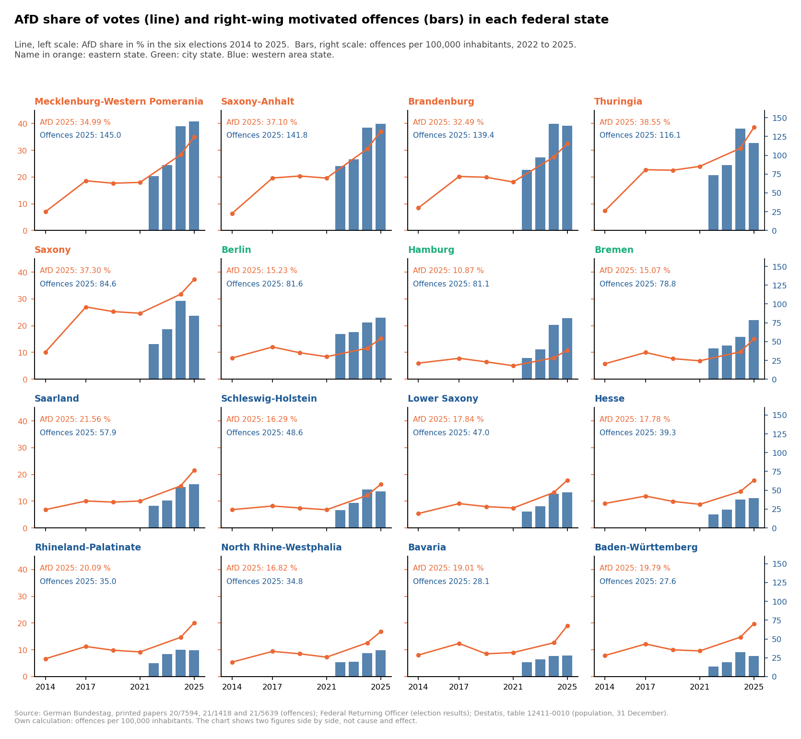

# Rechts motivierte Straftaten in Deutschland und AfD-Wahlergebnisse, 2014 bis 2025

🇬🇧 [English version](README.md)

Dieses Projekt untersucht, wie sich politisch rechts motivierte Straftaten in Deutschland von 2014 bis 2025 entwickelt haben: wie viele Straftaten die Polizei registriert hat, um welche Deliktarten es ging und wie sich die 16 Bundesländer unterscheiden. Die Wahlergebnisse der AfD werden danebengestellt. Das Projekt behauptet nicht, dass das eine das andere verursacht.

Verwendet werden nur amtliche, öffentliche Daten: die Polizeistatistik zur politisch motivierten Kriminalität (PMK) von BKA und BMI und die Wahlergebnisse der Bundeswahlleiterin.

Was als rechts motiviert gilt, legt dieses Projekt nicht selbst fest. Es gilt die Einstufung der Polizei (Phänomenbereich „PMK -rechts-"). Der Schwerpunkt liegt auf diesem Bereich, weil er rund die Hälfte aller 2025 registrierten politisch motivierten Straftaten ausmacht.

## Interaktives Dashboard

**Dashboard:** [https://right-wing-crime-germany-pmk.streamlit.app/](https://right-wing-crime-germany-pmk.streamlit.app/)

Das Dashboard gibt es auf Deutsch und Englisch. Die Sprache lässt sich oben auf der Seite umschalten.

Wie man es auf dem eigenen Rechner startet, steht unter [Ausführen](#ausführen).

## Fragen und Ergebnisse

Die Grafiken stammen aus dem Analyse-Notebook und sind englisch beschriftet. Im Dashboard sind alle Grafiken auch auf Deutsch verfügbar.

### 1. Wie haben sich die rechts motivierten Straftaten von 2014 bis 2025 entwickelt?

- **Die Straftaten sind in elf Jahren um 150 % gestiegen.** Die Polizei registrierte 17.020 Straftaten im Jahr 2014 und 42.544 im Jahr 2025. Der Höchstwert liegt bei 42.788 im Jahr 2024.
- **Der Anstieg kam in zwei Stufen.** Die Zahl stieg 2015 um 34,9 %, blieb bis 2022 zwischen 20.431 und 23.604 und stieg dann 2023 um 23,2 % und 2024 um 47,8 %.
- **Die Gewaltdelikte sind deutlich weniger gestiegen.** Sie stiegen von 1.029 auf 1.598 (+55,3 %). Der Höchstwert liegt bei 1.698 im Jahr 2016. Ihr Anteil an allen Straftaten sank von 6,05 % auf 3,76 %.


### 2. Aus welchen Deliktarten setzt sich die Gesamtzahl zusammen?

- **Sechs von zehn Straftaten sind Propagandadelikte** (59,0 % im Jahr 2025), gefolgt von Volksverhetzung (13,0 %) und Beleidigung (10,1 %). Gewaltdelikte machen 3,8 % aus.
- **Seit 2019 sind alle Deliktarten gestiegen.** Sachbeschädigung (+161,2 %) und Beleidigung (+142,8 %) sind prozentual am stärksten gewachsen.
- **Mehr als die Hälfte des Anstiegs entfällt auf Propagandadelikte:** 53,7 % der zusätzlichen Straftaten zwischen 2019 und 2025.


### 3. Wie unterscheiden sich die 16 Bundesländer?

- **Die Bundesländer unterscheiden sich um den Faktor 5,3.** 2025 verzeichnete Mecklenburg-Vorpommern 145,0 Straftaten je 100.000 Einwohner, Baden-Württemberg 27,6. Der Wert für Deutschland liegt bei 51,0.
- **Die Rate stieg von 2022 bis 2025 in allen 16 Ländern,** zwischen +35,3 % in Berlin und +190,7 % in Hamburg.
- **Die Länder bilden drei Gruppen.** 2025 verzeichneten die fünf östlichen Länder 118,7 Straftaten je 100.000 Einwohner, die drei Stadtstaaten 81,2 und die acht westlichen Flächenländer 35,1.
- **Die östlichen Länder haben 14,8 % der Bevölkerung und 34,5 % der Straftaten.**


### 4. Wie verhalten sich die AfD-Wahlergebnisse zu den Straftatenraten?

- **Über alle 16 Länder hängen die beiden Werte zusammen** (Korrelation 0,72 für die Bundestagswahl 2025).
- **Innerhalb der Gruppen nicht:** −0,53 unter den fünf östlichen Ländern und 0,08 unter den acht westlichen Flächenländern. Der Gesamtwert spiegelt den Unterschied zwischen den Gruppen.
- **Die Stadtstaaten passen nicht ins Gesamtbild.** Sie haben die niedrigsten AfD-Anteile (10,9 % bis 15,2 %) und mehr als doppelt so hohe Straftatenraten wie die westlichen Flächenländer.
- **Für Deutschland insgesamt sind beide Werte gestiegen,** aber nicht im Gleichschritt: Zwischen den Bundestagswahlen 2017 und 2021 sank der AfD-Anteil, während die Straftaten stiegen.


Die nächste Grafik zeigt jedes der 16 Bundesländer einzeln: den AfD-Anteil bei allen sechs Wahlen als Linie und die Straftatenrate von 2022 bis 2025 als Balken. Alle Felder haben dieselben Skalen. Der AfD-Anteil war 2025 in allen 16 Ländern höher als 2021, und die Straftatenrate war 2025 in allen 16 Ländern höher als 2022.



**Was dieser Vergleich zeigt und was nicht.** Er ist beschreibend. Er vergleicht 16 Bundesländer, nicht Menschen. Er sagt nicht, wer Straftaten begeht oder wer welche Partei wählt, und er zeigt keinen ursächlichen Zusammenhang. Die Länder unterscheiden sich in vielem anderen, unter anderem in der Erfassungspraxis der Polizei.

## Datenquellen

| Daten | Quelle | Zeitraum |
|---|---|---|
| Rechts motivierte Straftaten, Deutschland | BKA und BMI, Fallzahlen und Factsheets zur politisch motivierten Kriminalität; Deutscher Bundestag, Drucksache 18/5758 | 2014 bis 2025 |
| Rechts motivierte Straftaten, Bundesländer | Deutscher Bundestag, Drucksachen 20/7594, 21/1418 und 21/5639 | 2022 bis 2025 |
| Wahlergebnisse | Die Bundeswahlleiterin, endgültige Ergebnisse. Lizenz: Datenlizenz Deutschland – Namensnennung – Version 2.0 | Bundestagswahlen 2017, 2021, 2025; Europawahlen 2014, 2019, 2024 |
| Bevölkerung | Statistisches Bundesamt (Destatis), Tabelle 12411-0010, Stichtag 31. Dezember | 2022 bis 2025 |

Die Kriminalitätszahlen sind nicht an einer Stelle veröffentlicht und nicht als Tabellen, die sich per Code lesen lassen. Sie wurden von Hand aus den PDF-Dokumenten übertragen. Jeder einzelne Wert hat seine Quelle, mit Dateiname und Seite, in der Spalte `source` von `data/clean/pmk_rechts_bund.csv` und `data/clean/pmk_rechts_laender.csv`. Nichts wurde geschätzt oder ergänzt. Die vollständige Liste der Dokumente steht in `notebooks/01_data_preparation.ipynb` (Abschnitt 11) und im Dashboard. Datenlücken und Hinweise zur Datensammlung stehen in [`data/README.md`](data/README.md#deutsch).

## Aufbau des Projekts

```
right-wing-crime-germany-pmk/
├── data/
│   ├── raw/                      Originaldateien wie veröffentlicht
│   │   ├── pmk_bund/             Berichte von BKA und BMI, Drucksache 18/5758
│   │   ├── pmk_laender/          Drucksachen mit Zahlen je Bundesland
│   │   ├── wahlen/               Wahlergebnisse
│   │   └── bevoelkerung/         Bevölkerung
│   └── clean/                    Tabellen für Analyse und Dashboard
├── notebooks/
│   ├── 01_data_preparation.ipynb Daten laden, prüfen und aufbereiten
│   └── 02_analysis.ipynb         Analyse, Grafiken, Ergebnisse
├── dashboard/
│   └── app.py                    interaktives Dashboard (Streamlit)
├── figures/                      Grafiken aus dem Analyse-Notebook
├── requirements.txt
├── README.md
└── README.de.md
```

Die Notebooks sind auf Englisch geschrieben.

## Ausführen

```bash
pip install -r requirements.txt
streamlit run dashboard/app.py
```

Für die Notebooks wird zusätzlich Jupyter gebraucht (`pip install jupyter`). Zuerst `01_data_preparation.ipynb` ausführen, dann `02_analysis.ipynb`.

## Grenzen der Daten

- **Registrierte Straftaten, nicht alle Straftaten.** Die Statistik zählt nur Straftaten, die der Polizei bekannt wurden und die sie als politisch rechts motiviert eingestuft hat.
- **Die Einstufung nimmt die Polizei des jeweiligen Bundeslandes** in eigener Verantwortung vor. Unterschiede zwischen den Ländern können auf unterschiedliche Erfassung ebenso zurückgehen wie auf Unterschiede bei den begangenen Straftaten.
- **Die Deliktarten sind unvollständig.** Sie fehlen für 2015 und 2016, Beleidigung ist erst ab 2019 eine eigene Kategorie, und Nötigung/Bedrohung fehlt für 2020 und 2021.
- **Zahlen je Bundesland gibt es nur für 2022 bis 2025.** Für frühere Jahre wurden in den veröffentlichten Quellen keine Gesamtzahlen je Land gefunden.
- **Die Gewaltdelikte je Land für 2025 wurden gezählt,** aus der Liste der Einzelfälle in Bundestagsdrucksache 21/5639, weil die Drucksache diese Zahl je Land nicht nennt.
- **Die Zahlen können sich noch ändern,** weil Fälle nachgemeldet werden. Die Zahlen für 2025 sind am wenigsten gefestigt.

Alle Grenzen sind in den Notebooks beschrieben (jeweils Abschnitt 10).

## Wie dieses Projekt entstanden ist

Die Fragestellung, die Auswahl der Quellen und alle Entscheidungen stammen von mir. Die Dokumente habe ich selbst zusammengetragen und die Ergebnisse gegen die Quellen geprüft. Code und Texte sind mit Unterstützung von KI (Claude) entstanden. Wie ich mit KI arbeite, beschreibe ich in einem eigenen Repository: [local-ai-workflow](https://github.com/Amirhouschang/local-ai-workflow).

## Rechte

© 2026 Amirhoushang Rahmannejad. Alle Rechte vorbehalten.

Code, Texte und Grafiken dieses Projekts dürfen angesehen und geprüft, aber nicht kopiert oder weiterverwendet werden. Rückmeldungen sind über Issues willkommen. Die amtlichen Daten bleiben Eigentum der veröffentlichenden Behörden.
