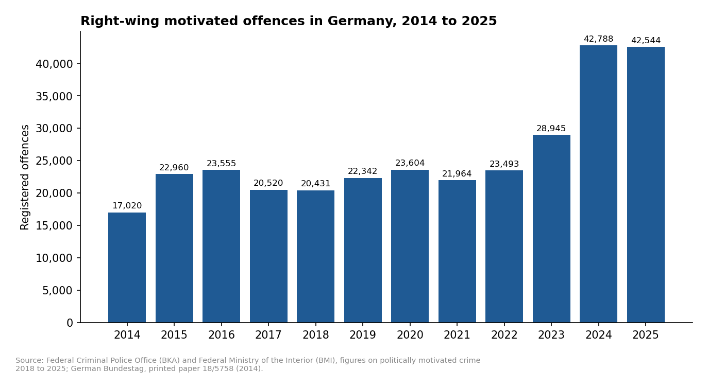
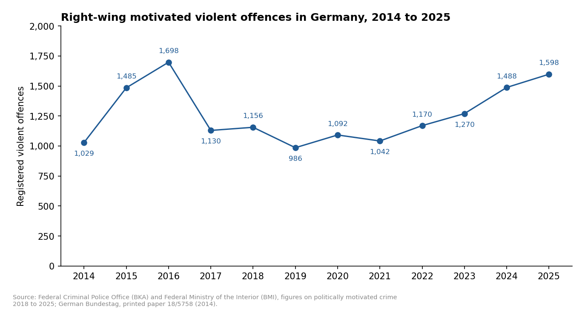
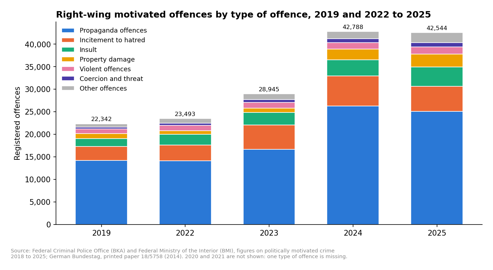
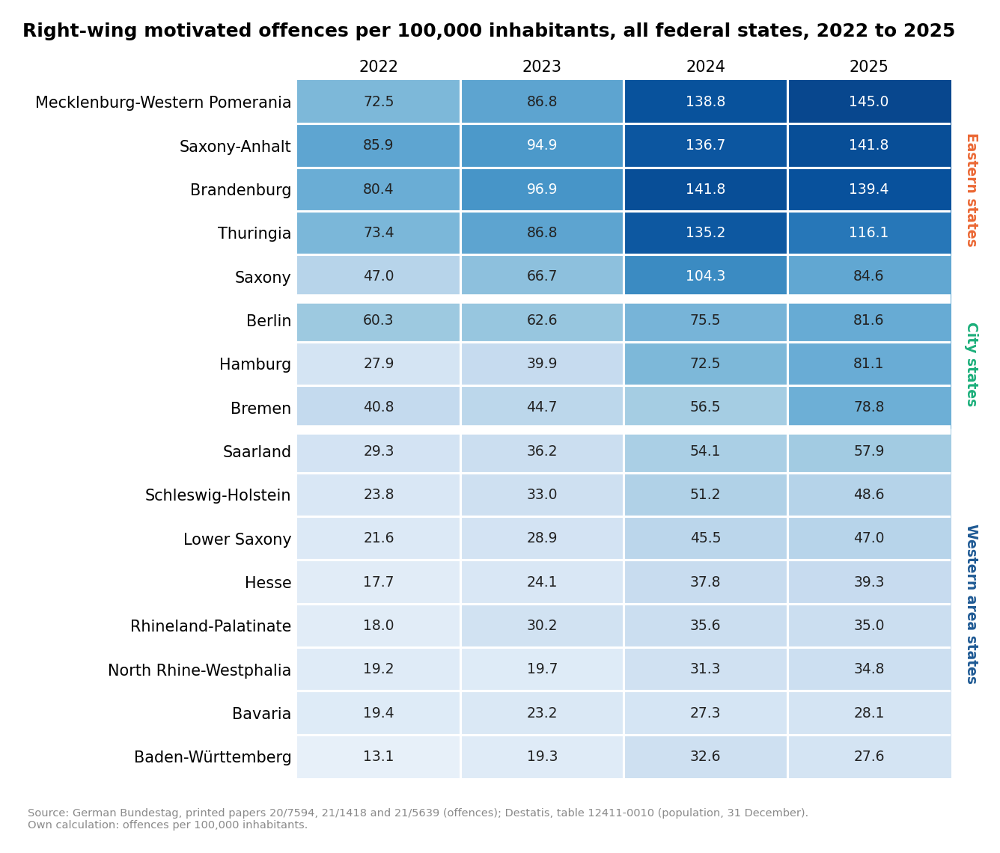
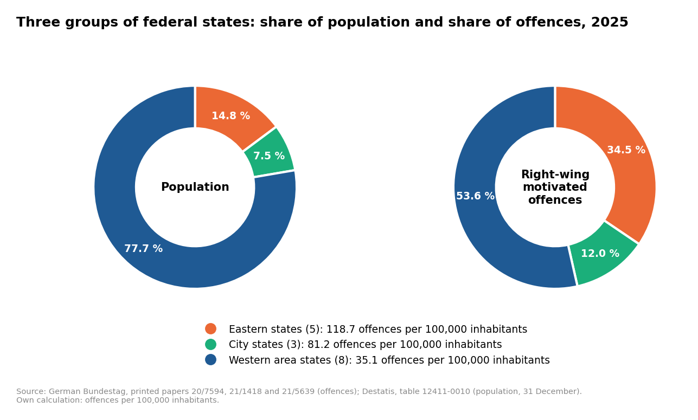
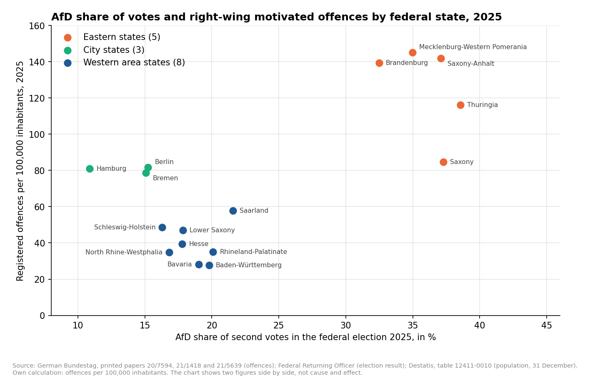
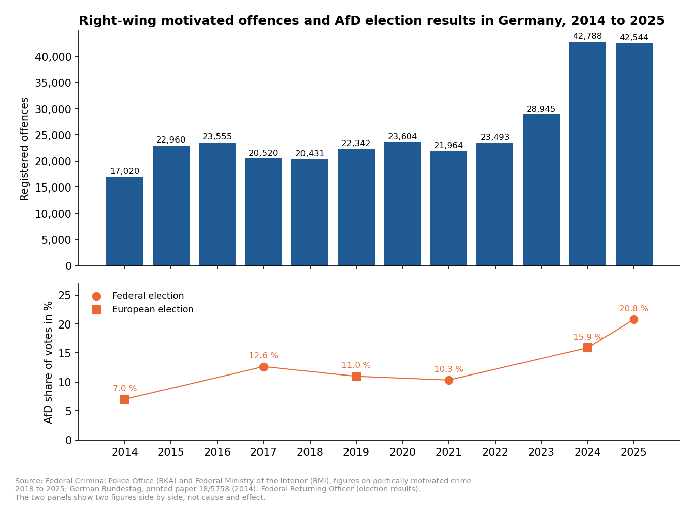

# Right-Wing Motivated Offences in Germany and AfD Election Results, 2014 to 2025

🇩🇪 [Deutsche Version](README.de.md)

This project analyses how politically right-wing motivated offences in Germany developed from 2014 to 2025: how many offences the police registered, which types of offence they were, and how the 16 federal states differ. The election results of the AfD are placed alongside. The project does not claim that one causes the other.

It uses only official, public data: the police statistics on politically motivated crime (Politisch motivierte Kriminalität, PMK) published by the BKA and BMI, and the election results of the Federal Returning Officer.

Which offences count as right-wing motivated is not defined in this project. The classification of the police is used (phenomenon area "PMK -rechts-"). The project focuses on this area because it accounts for about half of all politically motivated offences registered in 2025.

## Interactive dashboard

<!-- Add the link after publishing the app on Streamlit Community Cloud -->
**Dashboard:** link follows. The dashboard is available in German and English.

To run it on your own computer, see [How to run](#how-to-run).

## Questions and findings

### 1. How did right-wing motivated offences develop from 2014 to 2025?

- **The offences rose by 150 % in eleven years.** The police registered 17,020 offences in 2014 and 42,544 in 2025. The peak is 42,788 in 2024.
- **The rise came in two steps.** The number rose by 34.9 % in 2015, stayed between 20,431 and 23,604 until 2022, and then rose by 23.2 % in 2023 and 47.8 % in 2024.
- **Violent offences grew much less.** They rose from 1,029 to 1,598 (+55.3 %). The highest value is 1,698 in 2016. Their share in all offences fell from 6.05 % to 3.76 %.





### 2. Which types of offence make up the total?

- **Six in ten offences are propaganda offences** (59.0 % in 2025), followed by incitement to hatred (13.0 %) and insult (10.1 %). Violent offences are 3.8 %.
- **All types of offence rose since 2019.** Property damage (+161.2 %) and insult (+142.8 %) grew most in percent.
- **More than half of the rise comes from propaganda offences:** 53.7 % of the additional offences between 2019 and 2025.



### 3. How do the 16 federal states differ?

- **The federal states differ by a factor of 5.3.** In 2025 Mecklenburg-Western Pomerania recorded 145.0 offences per 100,000 inhabitants, Baden-Württemberg 27.6. The figure for Germany is 51.0.
- **The rate rose in all 16 states from 2022 to 2025,** between +35.3 % in Berlin and +190.7 % in Hamburg.
- **The states form three groups.** In 2025 the five eastern states recorded 118.7 offences per 100,000 inhabitants, the three city states 81.2 and the eight western area states 35.1.
- **The eastern states have 14.8 % of the population and 34.5 % of the offences.**





### 4. How do the AfD election results compare with the offence rates?

- **Across the 16 states the two figures move together** (correlation 0.72 for the federal election of 2025).
- **Within the groups they do not:** −0.53 among the five eastern states and 0.08 among the eight western area states. The overall figure reflects the difference between the groups.
- **The city states do not fit the overall pattern.** They have the lowest AfD shares (10.9 % to 15.2 %) and offence rates more than twice as high as the western area states.
- **For Germany as a whole both figures rose,** but not in step: between the federal elections of 2017 and 2021 the AfD share fell while the offences rose.





**What this comparison does and does not show.** It is descriptive. It compares 16 federal states, not people. It does not say who commits offences or who votes for which party, and it shows no cause and effect. Many other things differ between the states, among them the recording practice of the police.

## Data sources

| Data | Source | Period |
|---|---|---|
| Right-wing motivated offences, Germany | BKA and BMI, figures and fact sheets on politically motivated crime; German Bundestag, printed paper 18/5758 | 2014 to 2025 |
| Right-wing motivated offences, federal states | German Bundestag, printed papers 20/7594, 21/1418 and 21/5639 | 2022 to 2025 |
| Election results | Federal Returning Officer (Die Bundeswahlleiterin), final results. Licence: Datenlizenz Deutschland – Namensnennung – Version 2.0 | Federal elections 2017, 2021, 2025; European elections 2014, 2019, 2024 |
| Population | Federal Statistical Office (Destatis), table 12411-0010, reference date 31 December | 2022 to 2025 |

The crime figures are not published in one place and not as tables that can be read by code. They were transcribed by hand from the PDF documents. Every single value has its source, with file name and page, in the column `source` of `data/clean/pmk_rechts_bund.csv` and `data/clean/pmk_rechts_laender.csv`. Nothing was estimated or filled in. The full list of documents is in `notebooks/01_data_preparation.ipynb` (Section 11) and in the dashboard. Data gaps and notes on the data collection are in [`data/README.md`](data/README.md#english).

## Project structure

```
right-wing-crime-germany-pmk/
├── data/
│   ├── raw/                      original files as published
│   │   ├── pmk_bund/             reports of BKA and BMI, Bundestag paper 18/5758
│   │   ├── pmk_laender/          Bundestag papers with figures per federal state
│   │   ├── wahlen/               election results
│   │   └── bevoelkerung/         population
│   └── clean/                    tables used for analysis and dashboard
├── notebooks/
│   ├── 01_data_preparation.ipynb load, check and prepare the data
│   └── 02_analysis.ipynb         analysis, charts, findings
├── dashboard/
│   └── app.py                    interactive dashboard (Streamlit)
├── figures/                      charts created by the analysis notebook
├── requirements.txt
├── README.md
└── README.de.md
```

## How to run

```bash
pip install -r requirements.txt
streamlit run dashboard/app.py
```

To run the notebooks, Jupyter is needed in addition (`pip install jupyter`). Run `01_data_preparation.ipynb` first, then `02_analysis.ipynb`.

## Limitations

- **Registered offences, not all offences.** The statistics count only offences that became known to the police and that the police classified as politically right-wing motivated.
- **The classification is made by the police of each federal state** on their own responsibility. Differences between the states can reflect differences in recording practice as well as differences in the offences committed.
- **Types of offence are incomplete.** They are missing for 2015 and 2016, insult is a separate category from 2019 only, and coercion and threat is missing for 2020 and 2021.
- **Figures per federal state are available for 2022 to 2025 only.** For earlier years no totals per state were found in the published sources.
- **Violent offences per state in 2025 were counted** from the list of single cases in Bundestag printed paper 21/5639, because the paper does not print this number per state.
- **The figures can still change,** because cases can be reported later. The figures for 2025 are the least settled.

All limitations are described in the notebooks (Section 10 in each).

## How this project was made

The question, the choice of sources and all decisions are my own. I collected the documents myself and checked the results against the sources. The code and the texts were written with the support of AI (Claude). I describe how I work with AI in a separate repository: [local-ai-workflow](https://github.com/Amirhouschang/local-ai-workflow).

## Rights

© 2026 Amirhoushang Rahmannejad. All rights reserved.

The code, texts and charts of this project may be viewed and checked, but not copied or reused. Feedback is welcome through issues. The official data remains the property of the authorities that publish it.
